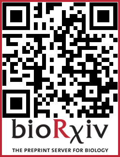

# DevSeqVNC

Developmental scRNAseq atlas of the Nerve Cord of *Drosophila melanogaster*.  

  

### Data availability
Raw sequencing data, CellRanger outputs and the final Seurat objects, are available at Gene Expression Omnibus (GEO) under accession number [GSE304221](https://www.ncbi.nlm.nih.gov/geo/query/acc.cgi?acc=GSE304221), and at BioProject under accession number [PRJNA1297747](https://www.ncbi.nlm.nih.gov/bioproject/PRJNA1297747). This data sources will remain embargoed until journal publication. Please get in touch if you would like earlier access.
  
For an interactive visualization of the data you can check our datasets on [Scope](https://scope.aertslab.org/#/HundredDrills/*/welcome).
 
Loom files have also available in Zenodo.
 
* VNC.loom: [10.5281/zenodo.17183028](https://doi.org/10.5281/zenodo.17183028)  
* VNC.neurons.loom: [10.5281/zenodo.17184089](https://doi.org/10.5281/zenodo.17184089)  
* VNC.glia.loom: [10.5281/zenodo.17185431](https://doi.org/10.5281/zenodo.17185431)  
 

The metadata file can be found in [metadata](https://github.com/FlyNeuroAtlas/DevSeqVNC/tree/main/metadata).
 

To download files and inspect the data see [File_Download_and_RDS_Data_Inspection.Rmd](https://github.com/FlyNeuroAtlas/DevSeqVNC/blob/main/Code/File_Download_and_RDS_Data_Inspection.Rmd).

  
### Citation
<!---->
#### A Developmental Atlas of the Drosophila Nerve Cord Uncovers a Global Temporal Code for Neuronal Identity
Sebastian Cachero, Myrto Mitletton, Isabella R. Beckett, Elizabeth C. Marin, Laia Serratosa Capdevila, Marina Gkantia, Jelly H. M. Soffers, Haluk Lacin, Gregory S. X. E. Jefferis, Erika Dona

**Preprint:** bioRxiv (2025)  
**DOI:** [https://doi.org/10.1101/2025.07.16.664682]
  
For questions and feedback plese contact us: 
&nbsp;Sebastian Cachero: scachero@mrclmb.ac.uk
&nbsp;Greg Jefferis: jefferis@mrclmb.ac.uk 
&nbsp;Erika Dona: erika.dona@cnr.it  

